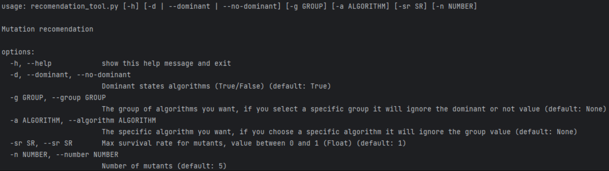
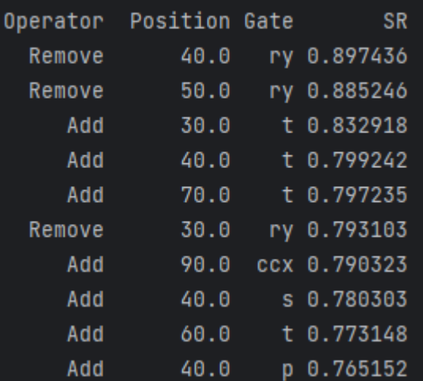

# Which Quantum Circuit Mutants Shall Be Used?

## Data

The data for this study can be obtained from [Data Source](https://www.dropbox.com/sh/y0somwhwwgkxopd/AAAJWGjyOfb9eeX8wXnzH27Va?dl=0). The data consist of the following:
- Original programs
- Mutated programs
- Origin programs execution results
- Mutated programs execution results

To ensure data integrity and suitability for analysis, the following steps were taken:

1. Data Collection:
   - The original circuits were obtained from the [MQTbench](https://www.cda.cit.tum.de/mqtbench/).
   - We used the [qasmToQiskit.py](DataCleaning/qasmToQiskit.py) to translate the Qasm files to Qiskit to be able to use Muskit as a mutator.
   - We used [Muskit](https://github.com/Simula-COMPLEX/muskit.git) to generate all posible mutants for the seelcted programs.
     
2. Execute the circuits:
   - Original circuits to obtain the test oracle
   - Mutated programs to obtain the outputs to check

3. Data Cleaning: The data cleaning process involved the use of several Python scripts available in the [Data Cleaning Folder](DataCleaning/). The scripts should be executed in the following order:

   - [mergeFiles.py](DataCleaning/mergeFiles.py): To merge all teh slurm output files obtained for the execution of the circuits. Origin files from one side and mutated files from the other.
   - [get_program_characteristics.py](DataCleaning/get_program_characteristics.py): To get all the original programs characteristics.
   - [saveResults.py](DataCleaning/saveResults.py): Obtain the csv with the results from the origin and mutated outputs.
   - [mergeCSV](DataCleaning/mergeCSV.py): Merge the csv obtained based on the algorithm.

## Analysis

For the analysis of the data, we have created two notebooks, each serving a specific purpose:

1. [Notebook 1 - Exploratory Data Analysis](Analysis/EDA.ipynb): This notebook contains exploratory data analysis and insights into the dataset.

2. [Notebook 2 - Results analysis](Analysis/AnalizeResults.ipynb): This notebook presents different visualizations and stadistics of the dateset.

## Recommendation Tool

Our recommendation tool is designed to recomend mutations for each type of algorithm. To use the tool, the [recomendation_tool.py](RecomendationTool/recomendation_tool.py) script needs to be executed using the parameters showed below:

[Help for the recomendation tool]

### Example

[Output of: `python .\recomendation_tool.py -n 10 -sr 0.9 -a 'ae'`]

Feel free to reach out if you have any questions or need further assistance with the data, analysis, or the recommendation tool.
